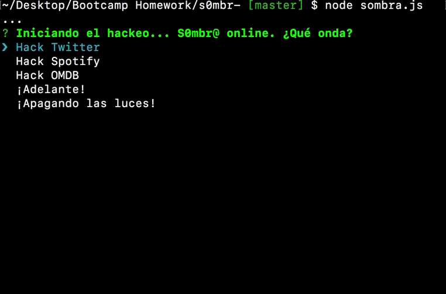

# s0mbr@ :skull:


Looks like Sombra's in the mood for some fun. In this command line app built with node, Sombra will take in various paramaters, hack the web, and bring that data back to you, displaying it in the terminal. Why the terminal? She's a hacker afterall, and doesn't want the taraditas to easily access her code. 

## Getting Started :floppy_disk:

### Prerequisites :open_file_folder:
Make sure you have node.js installed on your computer! You can download it via the installer on the official site
```
https://nodejs.org/en/download/
```
Then either clone or download this repo.

### Installation :file_folder:
Inside your terminal or command prompt, navigate to the location of the cloned repo. Install the necessary dependencies by running - 
```
npm i
```
In order for the application to run certain commands you will need your own set of keys and tokens from Twitter and Spotify. Generate the keys via Twitter and Spotify's developer sites and store them in a `.env` file

In your `.env` file replace the values with your API keys (no quotes):
```
# Spotify API keys

SPOTIFY_ID=your-spotify-id
SPOTIFY_SECRET=your-spotify-secret

# Twitter API keys

TWITTER_CONSUMER_KEY=your-twitter-consumer-key
TWITTER_CONSUMER_SECRET=your-twitter-consumer-secret
TWITTER_ACCESS_TOKEN_KEY=your-access-token-key
TWITTER_ACCESS_TOKEN_SECRET=your-twitter-access-token-secret
```

## Using the App :computer:


Type `node sombra.js` into your terminal to begin using the app. You can navigate through the commands using the up and down arrows and hitting enter. 

To exit the app either hold down `control + c` or select the last command `¡Apagando las luces!`



## Built With :cd:
* [Javascript](https://www.javascript.com/) - programming language
* [Node.js](https://nodejs.org/en/) - javascript runtime

### NPM Packages
* [Twitter](https://www.npmjs.com/package/twitter)
* [Node-Spotify-API](https://www.npmjs.com/package/node-spotify-api)
* [request](https://www.npmjs.com/package/request)
* [dotenv](https://www.npmjs.com/package/dotenv)
* [inquirer](https://www.npmjs.com/package/inquirer)

## Author :key:
* **Jimmy Tu** - [jimmytutron](https://github.com/jimmytutron)


## Acknowledgments :pray:
A big thank you to our instructor, Jerome, and the TAs, Amber, Ricky, and Sasha!!  :grimacing:
and to Blizzard Entertainment and Overwatch, for the inspiration and theme of this application.
