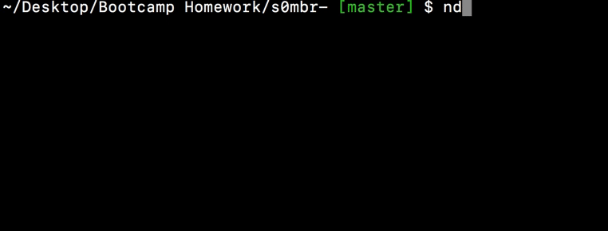
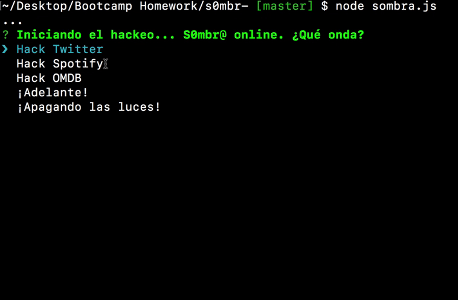

# s0mbr@
:skull: Sombra hacked Siri - a command line node app


Looks like Sombra's in the mood for some fun. In this command line app built with node, Sombra will take in various paramaters, hack the web, and bring that data back to you, displaying it in the terminal. Why the terminal? She's a hacker afterall, and doesn't want the taraditas to easily access her code. 

## Getting Started

### Prerequisites
Make sure you have node.js installed on your computer! You can download it via the installer on the official site
```
https://nodejs.org/en/download/
```
Then clone down this repo.

### Installation
Inside your terminal or command prompt, navigate to the location of the cloned repo. Install the necessary dependencies by running - 
```
npm i
```
In order for the application to run certain commands you will need your own set of keys and tokens from Twitter and Spotify. Generate the keys vis Twitter and Spotify's developer sites and store them in a `.env` file

## Using the App

